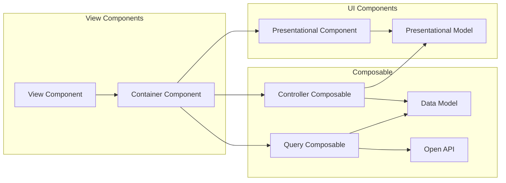

# Model / Dashboard ~ Presentational Model

Presentational Componentに渡す情報をPresentational Modelとして予め生成する戦略

||View Component|Container Component|Presentational Component|Controller Composable|Query Composable|
|-|-|-|-|-|-|-|
|OpenAPIを知っている|No|No|No|No|Yes|
|DataModelを知っている|Maybe|Yes|**NOT RECOMMENDED**|Yes|Yes|
|PresentationalModelを知っている|No|Yes|Yes|Yes|No|
|useRouteを使用|Yes|No|No|No|No|
|useRouterを使用|Yes|Yes|No|No|No|
|router-viewを使用|Yes|No|No|-|-|
|refを使用|No|Yes|Maybe|-|-|
|i18nを使用|No|Maybe|Yes|-|-|
|styleを使用|No|Maybe|Yes|-|-|

